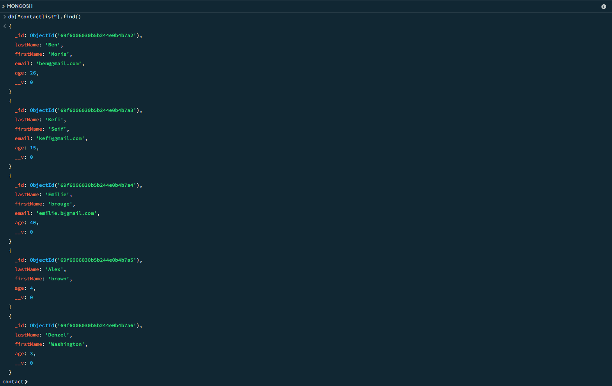
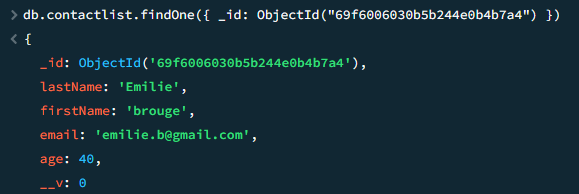
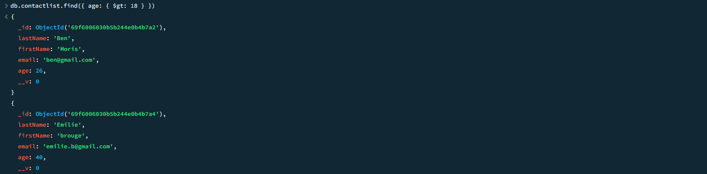
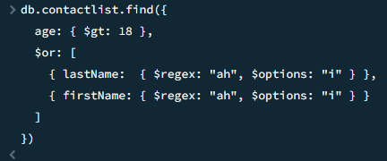
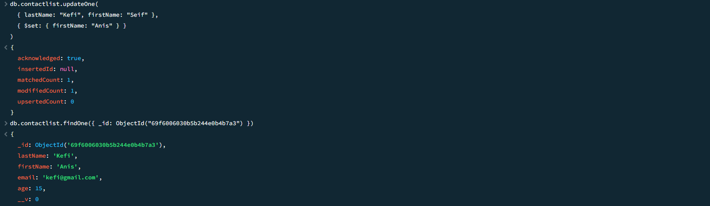
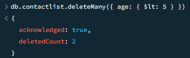
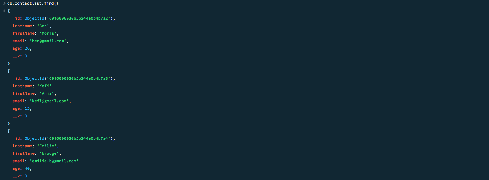

# MongoDB Checkpoint — Solutions

## 1 — Display all contacts

```js
db.contactlist.find()
```



---

## 2 — Display one contact by ID

```js
db.contactlist.findOne({ _id: ObjectId("<id>") })
```



---

## 3 — Contacts with age > 18

```js
db.contactlist.find({ age: { $gt: 18 } })
```



---

## 4 — Age > 18 AND name contains "ah"

```js
db.contactlist.find({
  age: { $gt: 18 },
  $or: [
    { lastName:  { $regex: "ah", $options: "i" } },
    { firstName: { $regex: "ah", $options: "i" } }
  ]
})
```



---

## 5 — Update Kefi Seif → Kefi Anis

```js
db.contactlist.updateOne(
  { lastName: "Kefi", firstName: "Seif" },
  { $set: { firstName: "Anis" } }
)
```



---

## 6 — Delete contacts aged under 5

```js
db.contactlist.deleteMany({ age: { $lt: 5 } })
```



---

## 7 — Display all contacts (final)

```js
db.contactlist.find()
```


